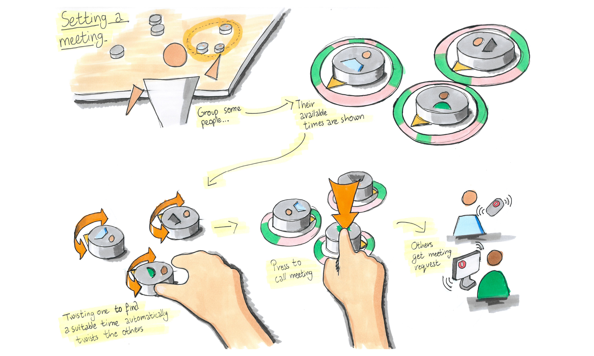
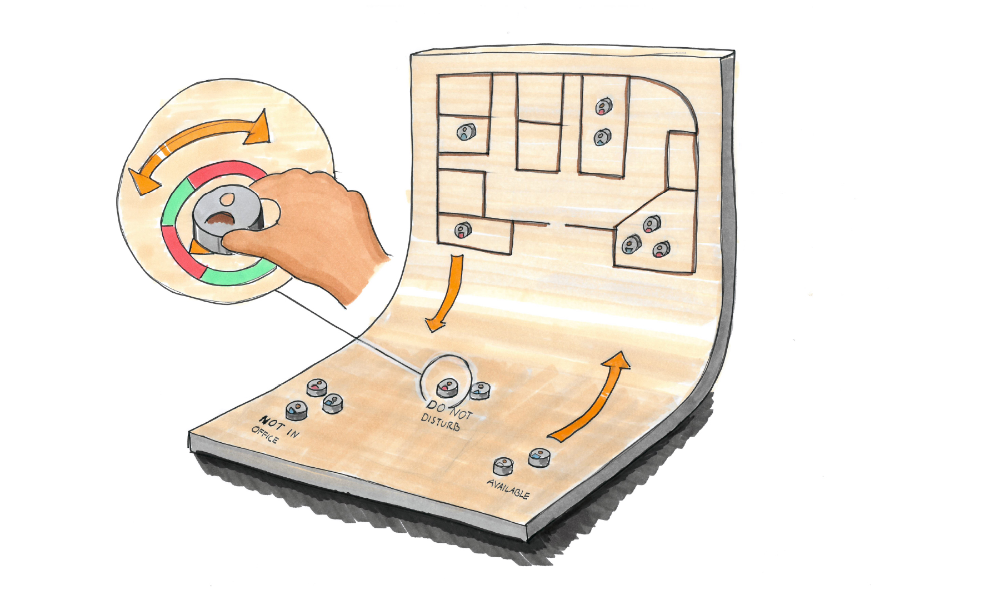
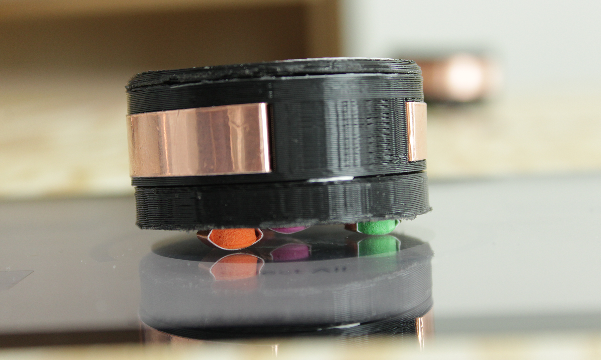
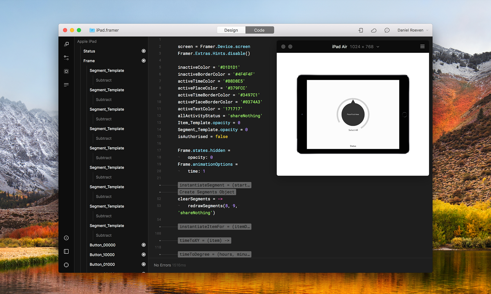

## Status Table: prototyping a tangible UI with Framer and Arduino

### *01* About

I designed and prototyped a digital tabletop interface in a team of five people. The goal of this project was to explore how colleagues in office environments can share parts of their schedules with each other, while providing them with an embodied sense of privacy through physical interactions.

<iframe src="https://player.vimeo.com/video/283298796?autoplay=0&loop=0&color=ABEAF7&title=0&byline=0&portrait=0" frameBorder="0"></iframe>

### *02* What is tangible interaction?

[Tangible user interfaces](https://en.wikipedia.org/wiki/Tangible_user_interface) are a way to manipulate digital information through physical interactions. They make optimal use of our physical skills rather than relying solely on cognitive skills (as in GUIs). This enables numerous benefits: muscle memory, thinking-by-doing, and easy collaboration, to name a few.

### *03* Concept development

To design and develop our concept, we conducted a study of existing digital office planning tools and calendars. We also extensively studied literature on the topic of tangible interaction. In early stages of the project, I honed our ideas by creating sketches of our envisioned system—this helped us solidify and reason about our concepts, as well as aligning the team's vision.

### *04* Prototyping

To prototype and evaluate our product, we used a combination of hardware and software. To prototype the larger interactions requiring gross motor skills, we 3D-printed personal pucks with RFID tags inside that users can "check in" on an Arduino. This allows them to view the schedule of the person on a WiFi-connected iPad.

<iframe src="https://player.vimeo.com/video/290135679?autoplay=1&loop=1&color=ABEAF7&title=0&byline=0&portrait=0" frameBorder="0"></iframe>

The microinteractions with the digital tabletop were prototyped and evaluated on the iPad. I played a large role in creating a Framer prototype and 3D-printing pucks with electronics inside. Available interactions with the pucks were twisting and pressing.

<iframe src="https://player.vimeo.com/video/290147070?autoplay=1&loop=1&color=ABEAF7&title=0&byline=0&portrait=0" frameBorder="0"></iframe>

To detect these interactions, copper tape was wired around the 3D-printed puck, connecting to foam stubs on the bottom of the pucks. When a user touches the puck, the copper wiring turns into capacitive touch points—allowing our Framer prototype to detect twisting. When pushing on the puck, a third contact point is created with the iPad—allowing the prototype to detect pressing.

I was responsible for a large part of the Framer prototype that runs on an iPad embedded in the table. The iPad Framer prototype combined two input sources: the scanned RFID tags (via an Arduino hosted WiFi network), and the twistable and pressable pucks with capacitive touch points.

### *05* Results

The physical prototype was evaluated with the [NASA-TLX questionnaire](https://en.wikipedia.org/wiki/NASA-TLX). It showed the viability of our tangible UI to facilitate office planning and scheduling. The video and physical prototype successfully demonstrated our achievement of the learning outcomes of the course and the project was graded with the highest marks: 5 out of 5.

### *06* Takeaways

- Sketches are very useful in conveying and clarifying envisioned concepts.
- Ensure that each prototype has a specific purpose or goal. The video prototype demonstrates the concept holistically and conveys the desired user experience. The physical prototype  demonstrated the physical interactions and proved hardware and software implementation feasibility.
- Developing the prototype out of independent components gave us the necessary flexibility to pivot when implementation issues arose.