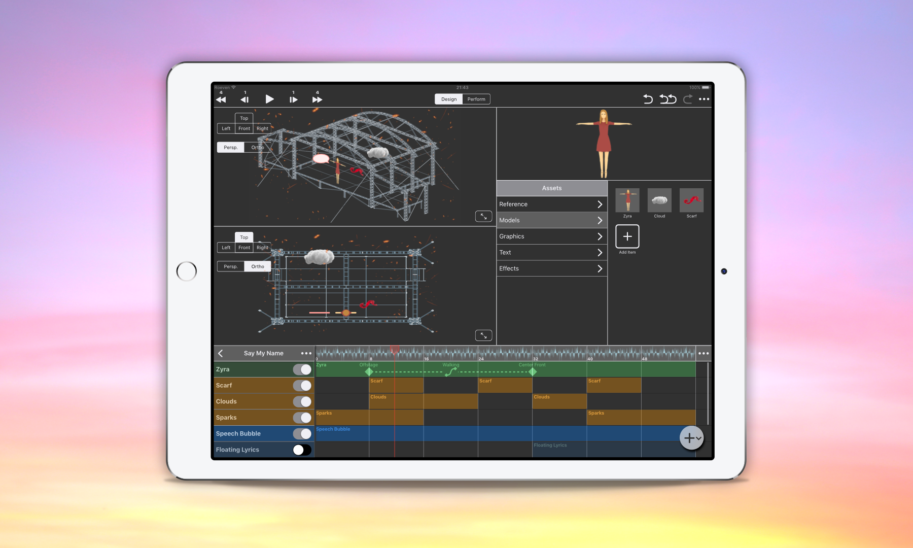
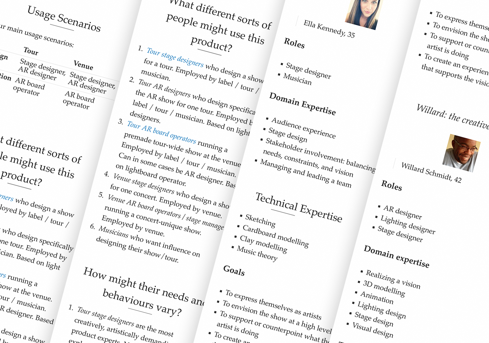
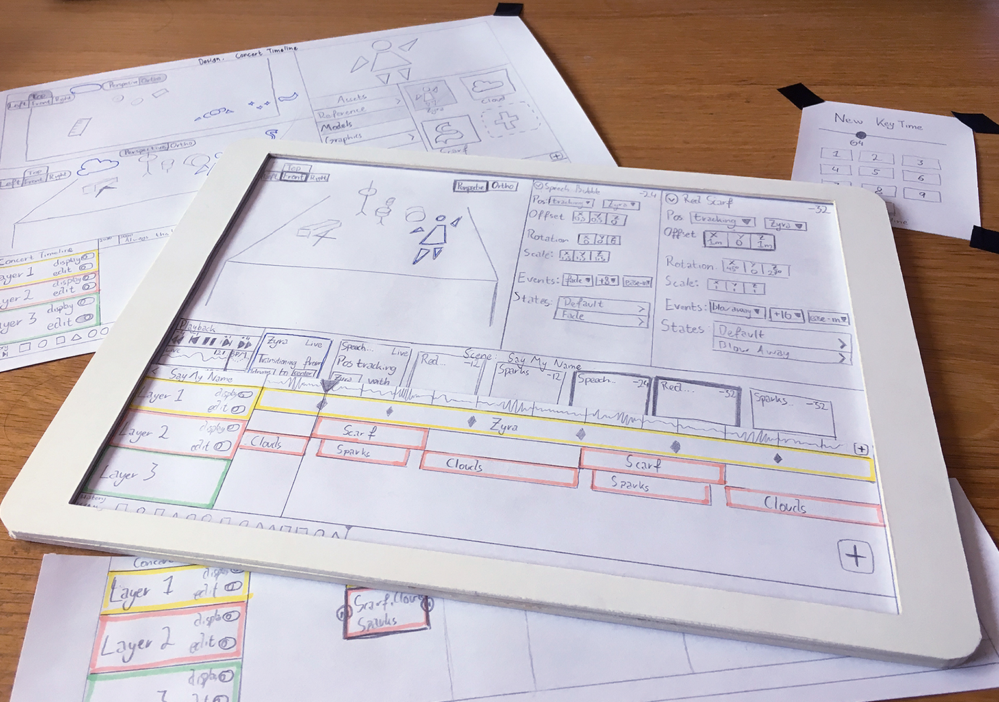
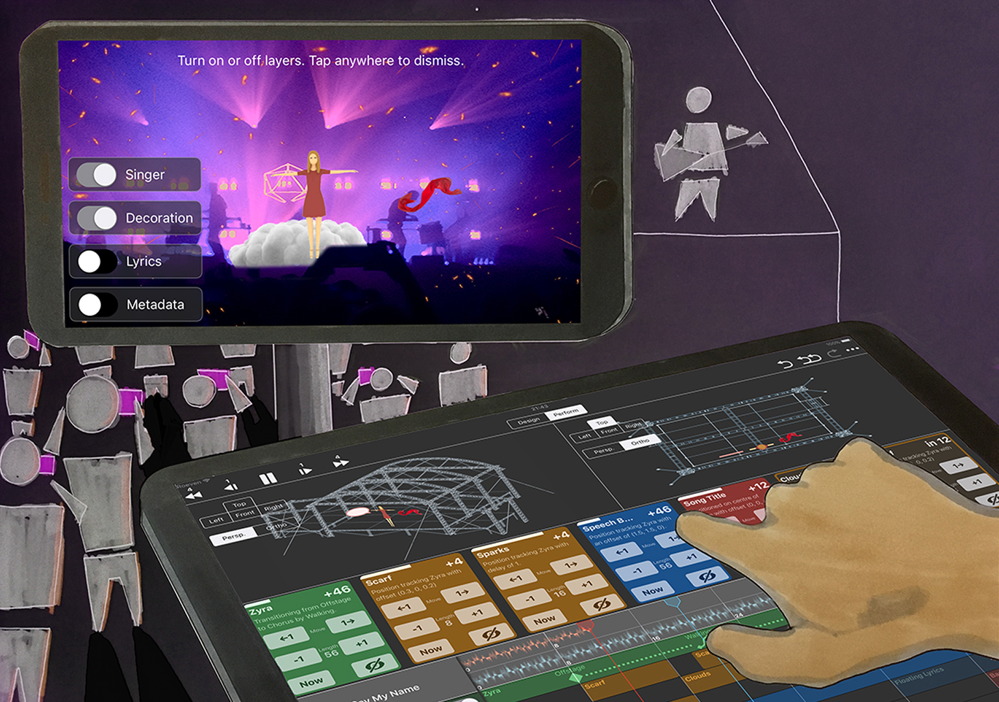

## AR Show Design App

### *01* About

In this case study, I describe the design process of my final project for a course on UI design at the masters programme Interaction Design at Chalmers University of Technology. In this individual project, we were tasked to design the graphical interface for a complex authoring tool, in a limited timeframe (three weeks from brief to deliverable).

### *02* Process Overview

I set up a suitable design process, conducted user and competitive product research, identified user goals, developed the product model, and sketched and prototyped the interface from low to high fidelity.

### *03* Learning Outcomes

- Translating user goals into a GUI, such that the interface empowers the user to achieve their goals.
- Setting up a correct design process. Good planning ensures that no part of the process gets underserved.
- A correct design process tells you know when, where, and how much time you have to be creative. This is important for creative professionals, as you need to deliver on the deadline.
- How to leverage existing UI design patterns, conventions and paradigms.
- How to design a complex UI under time pressure.

### *04* Project Brief

The brief was to design a tool to create augmented reality shows for concerts. Such a tool would be used by show/lighting designers and technicians. The tool would be used for design (before the show) and performance (during the show). The AR show would then be viewed by concert-goers on their smartphones.

### *05* Timeframe

The timeframe was three weeks from brief to deliverable. With a 50% course workload, that meant I had a total of 60 hours available. I set out a precise schedule, including activities, design phases, and WIP deliverables. Taking the time to plan and set out a detailed design process ensured that no part gets snowed under, and is important in the creative profession, as it tells me exactly when, where, and how much time I have to be creative, and when I need to deliver to meet the deadline.

### *06* Research

Due to the limited timeframe, extensive user research was not possible. As a compromise between depth and breadth, I conducted one lengthy interview with a VJ (video-jockeys create visual shows for the audience), read articles on show, stage, and lighting design, and rewatched a documentary on stage design (Abstract episode 3).

This gave me a basis from which to form user goals such as “supporting or counterpointing what the artist is doing”, “creating an experience for the audience”, “translating from vision to implementation”, and “performing a flawless show”. I also created storyboard scenario’s for the persona’s. This gave the design process an initial direction, and also allowed me to validate the final design to the usage scenario’s. After setting up these user goals, I conducted a competitive product analysis. This included comparing existing products for AR design, lighting design, timeline-based audio tools, and VJ software.

### *07* Product Model

With the above, I could form the product model, form factor, and posture. Controls needed to be as direct as possible, and should support several simultaneous interactions. Furthermore, the tool needs to be very mobile (from design studio, to meetings, to venue). A camera and gyroscope could provide instant AR previews. These requirements led me to the tablet (iPad Pro, 12.9”) as a platform.

### *08* Sketching

At this point I started creating lots of sketches and testing lots of ideas, because like Linus Pauling said:

<blockquote>“The best way to have a good idea is to have a lot of ideas.”</blockquote>

I created a 1:1 scale cardboard model of the iPad, which allowed me to sketch on A4 paper which I could then put in the iPad and test immediately. It also allowed me to run quick and dirty paper prototype tests, and quickly adjust the layout and interactions.

### *09* Wireframe to Hi-Fi Prototype

After lots of sketches on paper, I started wireframing in Sketch.app. During wireframing, more user tests were done. These continuous feedback loops were included in every level of fidelity, and allowed for course adjustments along the way. After wireframing and basic validation, I started creating prototype that focused on look-and-feel and visual design. The cardboard iPad was used to preview the design at actual size, and I made a Framer prototype for an old, smaller iPad to test navigation and gestures.

### *10* Validation

Because the high-fidelity prototype was built entirely with Sketch symbols, I could easily construct the interface for every step in the inital scenario’s. This allowed me validate the requirements and scenario’s, and get an overview of the whole interaction flow. I also made an annotated overview of the interface. The hi-fidelity scenario’s can be seen <a href="#">here</a> and the annotated interface overview is available <a href="#">here</a>.

