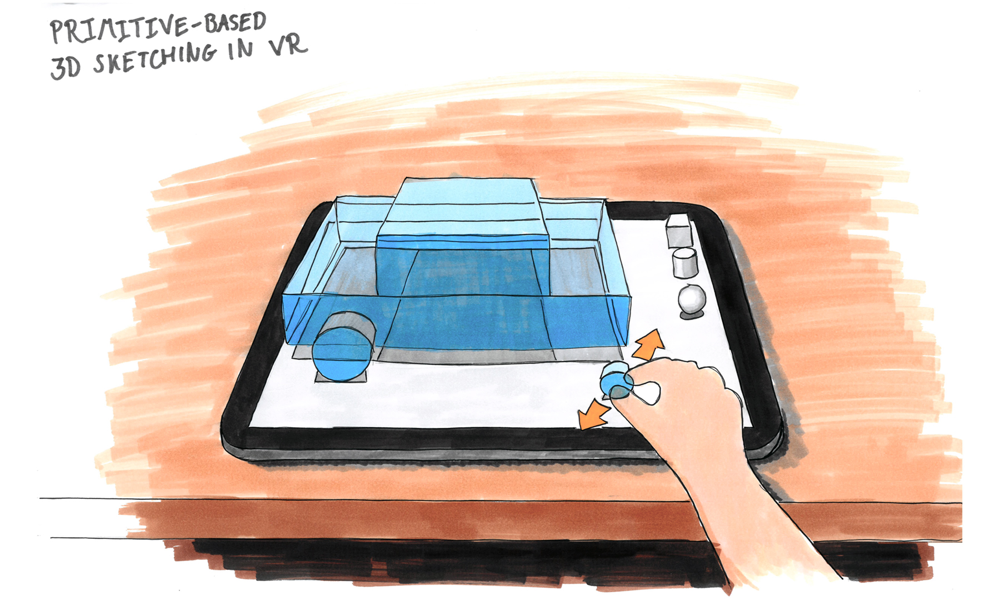
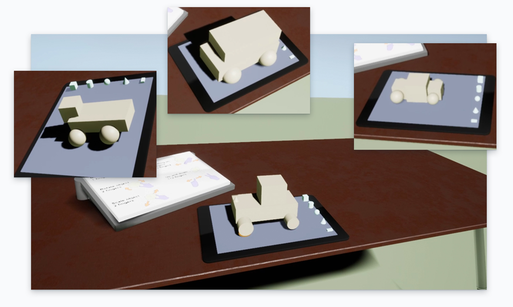

## CyberSketch: multitouch tablet input for VR

### *01* About

Current handheld VR controllers are prone to reliability and precision issues and require specialised hardware setups like tracking cameras. Furthermore, they are fatiguing to use for extended periods of time—an effect known as the "[gorilla arm](https://en.wikipedia.org/wiki/Touchscreen#"Gorilla_arm")".

In this project, we created a new input mechanism for VR to solve these problems. As a demonstration of this new input mechanism, we designed and developed a gestural 3D sketching and modelling tool, to quickly visualise concepts in true 3D.

<iframe src="https://player.vimeo.com/video/272779701?autoplay=0&loop=1&color=ABEAF7&title=0&byline=0&portrait=0" frameBorder="0"></iframe>

<column-wrapper>
<half-column>

### *02* Responsibilities

- VR Research
- Interaction design for VR
- Prototyping in iOS with Swift and Unreal Engine
- UX evaluations

</half-column>
<half-column>

### *03* Team

I teamed up with [Ajla Cano](www.ajlacano.com) to carry out this design and research project.

### *04* Timeframe

Eight weeks half-time.

</half-column>
</column-wrapper>

### *05* Concept

By using a tablet resting on a table as input for VR, the user can rest their arms, preventing arm fatigue. This allows the user to perform serious work for long periods of time. Additionally, multitouch tablets have very high accuracy, making it possible to do precise work.

Since the user is wearing a VR headset, we recreated the physical surroundings (desk and tablet) in VR. This way, the user can interact with the VR world by reaching out and touching the physical tablet.

The fully functional prototype was developed in two parts: an iOS app in Swift for iPad as the input mechanism, and an Unreal Engine project for an Oculus Rift VR headset.

### *06* Outcome

In a UX evaluation, we asked users to "sketch" cars, in order to see whether users experienced our setup as pleasant to use, and to confirm that our sketching tool offers the necessary freedom of expression. Most users were succeeded: they quickly sketched very different cars in 3D.

Furthermore, the participants evaluated our system with the [Microsoft reaction cards](https://en.wikipedia.org/wiki/Microsoft_Reaction_Card_Method_(Desirability_Testing)), to determine the UX and desirability. Positive adjectives they used to describe our system were: 

<blockquote>
"Straightforward, Clean, Engaging, Entertaining, Approachable, Creative"
</blockquote>

Negative adjectives were: unrefined, difficult, and inconsistent. In the following interview, we uncovered that many of these reactions were due to the fact that participants wanted to make use of all three dimensions of freedom in VR, and felt constrained by having to interact with the two-dimensional tablet, despite its benefits of accuracy and lack of arm fatigue. As such, further work would focus on how to better convey and emphasise its benefits to the user through interaction, and increase their experienced freedom of interaction.

### *07* More information

[Read our full research paper](/CyberSketch.pdf), or [clone the project from GitHub](https://github.com/DanielRoeven/vr-3d-sketching).