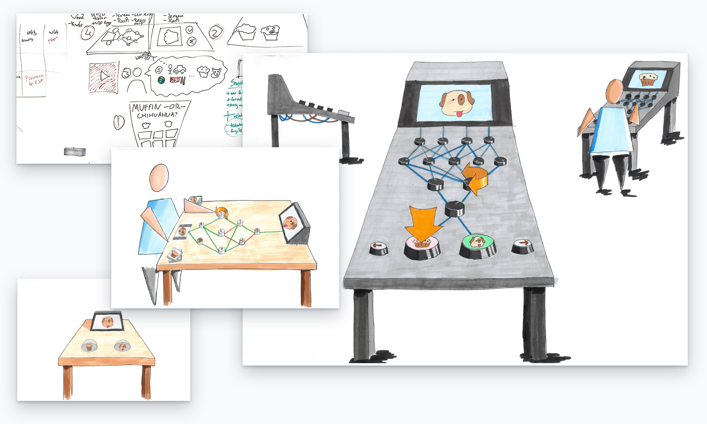
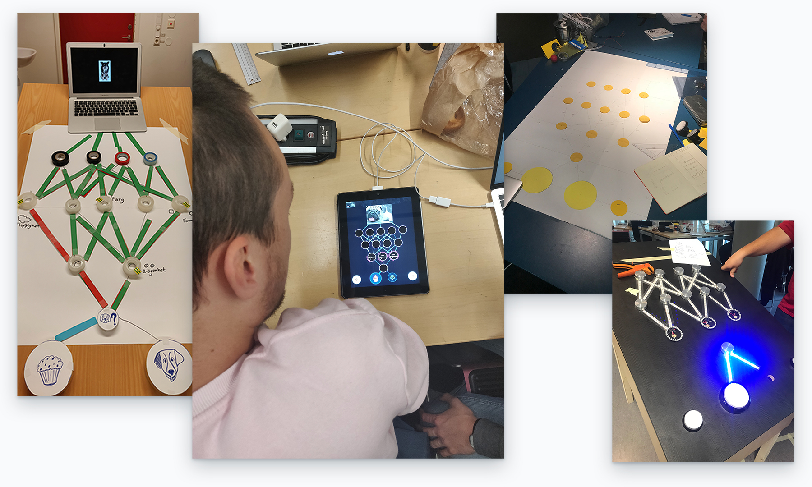
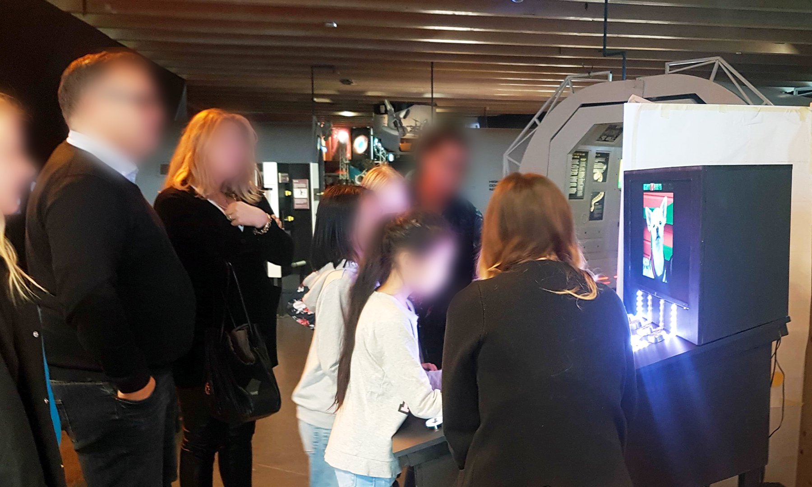

## Muffin or Chihuahua: an Interactive Museum Experience about Machine Learning

### *01* About

Muffin or Chihuahua was an interactive installation created for Universeum, a science museum in Gothenburg, Sweden. It introduces machine learning to 12 to 16 year-olds, with the ultimate goal of inspiring a new generation, specifically girls, to consider engineering as a career or study path.

The project was a great success and we were invited back to display the installation again at the opening of Universeum's new exhibition on upcoming technologies.

<iframe src="https://player.vimeo.com/video/323536599?autoplay=0&loop=1&color=ABEAF7&title=0&byline=0&portrait=0" frameBorder="0"></iframe>

<column-wrapper>
<half-column>

### *02* Responsibilities

In this project, I focused on further developing the following skills:

- Project Management
- Prototyping
- Software Development
- Installation Construction

### *03* Timeframe

Six weeks half-time.

</half-column>
<half-column>

### *04* Team

A worked in an all-star team with fellow students:

- <a href="https://www.ajlacano.com" target="_blank">Ajla Cano</a>
- <a href="https://www.linkedin.com/in/mattias-johansson-19b770108/" target="_blank">Mattias Johansson</a>
- <a href="https://www.linkedin.com/in/alexander-karlsson-648462173/" target="_blank">Alexander Karlsson</a>
- <a href="https://marianamanrique.com" target="_blank">Mariana Manrique</a>

### *05* Client

<a href="https://www.universeum.se/en/" target="_blank">Universeum</a>, a science museum in Gothenburg, Sweden.

</half-column>
</column-wrapper>

### *06* Concept

The installation consists of three parts:

- A humorous game in which visitors are asked to guess whether a displayed image is a muffin or a chihuahua.
- A video in which an engineer explains the concept of machine learning, by referring to the muffin-or-chihuahua example.
- A game in which visitors "train" the installation to recognize the difference between a muffin or a chihuahua, by tweaking the importance of feature nodes in the neural network.

### *07* My Role

In this project, I focused on further developing my project management skills. At a high level, the activities included ensuring that our team was solving the right problem at the right level, helping our team not get stuck, and trying to shape suitable roles for everybody in the project (a role that combined their expertise with the skills they want to develop). At a concrete level, it included kickstarting ideation sessions with warmup exercises or guiding sprint retrospectives.

Besides these activities, I contributed to the prototyping efforts at low and high fidelities. Framer prototypes I created served as  proof-of-concepts, giving us the confidence to proceed and allowing us to fine-tune the details. Other tasks included the construction of the installation and electronics, and software development.

### *08* Outcome and Reception

The Muffin or Chihuahua installation was a great success. The theme and game attracted 12-16 year olds and parents alike.

The feedback from the client was overwhelmingly positive too:

<blockquote>
"Very ambitious and professional looking exhibit that tackles a hard to explain subject. We are super impressed with your scope and finish."
</blockquote>

Due to the success of the first exhibition, we were invited back to display the installation again at <a href="https://www.universeum.se/inbjudan-the-hub/">Universeum's opening event</a> of their new exhibition on new technologies.