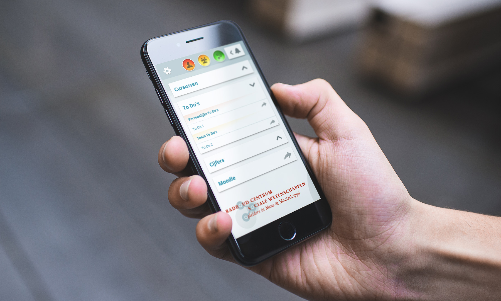

## Portal for RCSW

### *01* About

I designed and developed an online portal for the Radboud Centre for Social Sciences. The portal unifies information from varying services and provides clear overview and access.

<column-wrapper>
<half-column>

### *02* Responsibilities

- Interaction Design
- User Interface (UI)
- User Experience (UX)
- Visual Design
- Front-End Development (React)

</half-column>
<half-column>

### *03* Organisation

<rcsw-logo-link href="https://rcsw.nl"></rcsw-logo-link>

### *04* Timeframe

Four months part-time.

</half-column>
</column-wrapper>

### *05* Role

I designed the interface and user experience and developed the front-end in React. I worked as the interaction designer alongside two developers in a team of three.

### *06* Process

Existing user research indicated that users felt overwhelmed by the amount of services and information in the previous system. Yet simultaneously, users wanted to know what’s happening in other parts of the organisation at a glance. This was further validated by us through interviews and questionnaires.

We addressed this by creating a portal which unifies the information flows of varying sources and hierarchies. In this portal users can select which information to view by relevancy: personal, team-wide, or organisation wide. Explicitly marking the information flows by color and group, and toggling them on or off gives users the best of both worlds: quick access to specific information, and an overview of the whole when desired. Finally, the portal also serves as a springboard to specific services, through single sign-on.

The interface was validated through “thinking out loud” evaluations. This showed that users of the new interface easily understood and manipulated the information flows.

<iframe src="https://player.vimeo.com/video/256219151?autoplay=1&loop=1&color=ABEAF7&title=0&byline=0&portrait=0" frameBorder="0"></iframe>