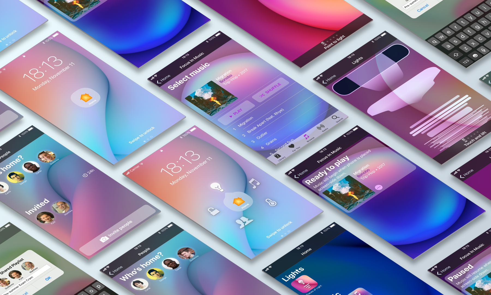
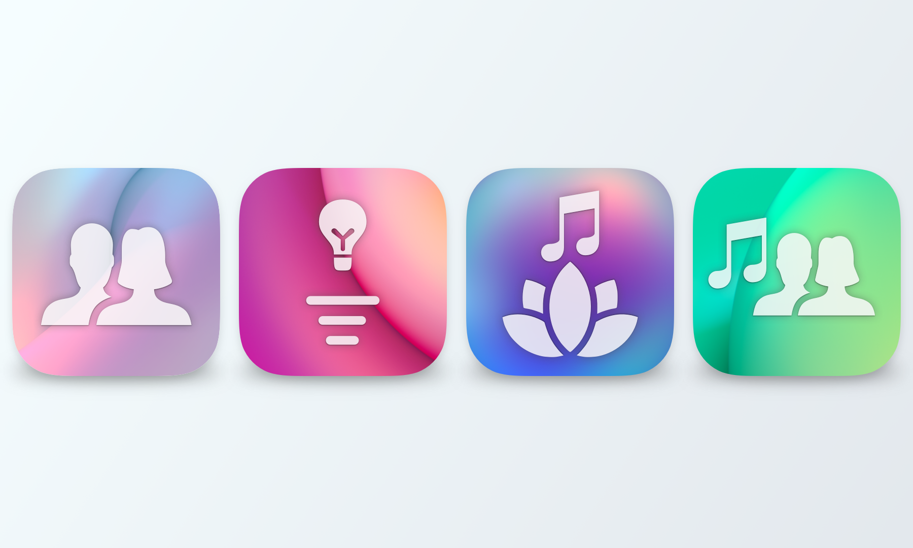

## Smart Home Redesign

### *01* About

In this project, I redesigned the smart home and an accompanying iOS app. I focused on creating a smart home that instead of simply automating, actually **enriches** living. I try to do this by making it pleasurable to use, by subconsciously capturing and replaying memories, and by stimulating the user to reflect.

### *02* Context

The project was carried out individually for a course on designing user experiences at Chalmers University of Technology. The timeframe was three weeks, half-time. I designed four apps: two very different music players, a light control app, and a way to invite your friends to interact with your smart home. These apps are showcased with videos below.

### *03* App: Focus in Music

This is a music player app that is specifically designed to help you focus—by quite literally getting out of the way. It only plays music when placed screen-side down, and pauses when you flip over your phone and start interacting.

<iframe src="https://player.vimeo.com/video/290750719?autoplay=0&loop=0&color=ABEAF7&title=0&byline=0&portrait=0" frameBorder="0"></iframe>

### *04* App: Light Control

This app controls the lights in your home, but also shows usage over time. By having the dimmer slider "leak" light onto the screen, it displays the history of the interaction with the lamp.

<iframe src="https://player.vimeo.com/video/290751405?autoplay=0&loop=0&color=ABEAF7&title=0&byline=0&portrait=0" frameBorder="0"></iframe>

### *05* Apps: Inviting Friends and Music Together

This app allows you to create playlists together with friends. The playlist is also saved for later, along with photos of people at the event. Every time you open the app, you are greeted with random playlists with friends—triggering memories of the event and allowing you to "relive" it.

<iframe src="https://player.vimeo.com/video/290751280?autoplay=0&loop=0&color=ABEAF7&title=0&byline=0&portrait=0" frameBorder="0"></iframe>

### *06* Result

The result is a collection of apps that rethink what it means to interact with a smart home. With this project, I show that the smart home has greater potential than automating our lives or doing our chores. Evaluations with fellow students showed the promise of this intriguing concept. The feedback provided by my supervisor, too, was positive:

<blockquote>"Wow-points for well-designed interaction in terms of phone gestures and movements. In conclusion a solid concept supported by a series of quite well executed designs, very well grounded in literature and methods."
</blockquote>

The project was graded with the highest marks: 5 out of 5.

### *07* Full presentation

The full presentation, including full design rationale and process, literature, and a brief discussion on societal and ethical considerations can be seen here:

<iframe src="https://player.vimeo.com/video/290745878?autoplay=0&loop=0&color=ABEAF7&title=0&byline=0&portrait=0" frameBorder="0"></iframe>